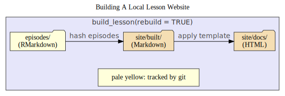
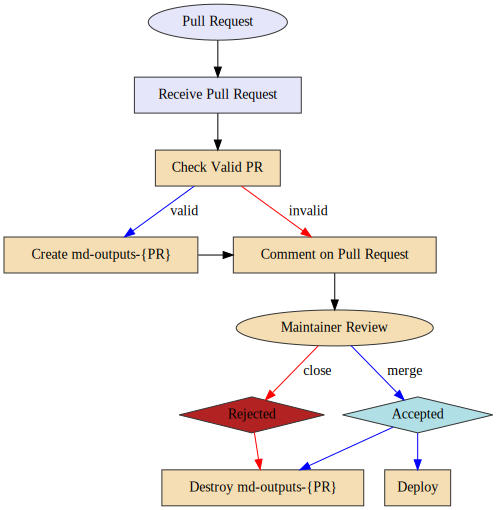

```{css, setup, echo = FALSE, include = FALSE}
.info {
  display: block;
  width: 100%;
  font-weight: bold;
  background: #e6ffff;
  margin-left: auto;
  margin-right: auto;
  padding: 20px 25px;
  border-width: 3px;
  border-style: solid;
  border-color: #1695A3;
  border-radius: 20px;
  /*box-shadow: 10px 10px 20px -5px gray;*/
}
```


## Introduction

The new lesson infrastructure has a lot of moving parts, but it is built on a
solid foundation that clearly separates the content from the tooling needed.
Importantly, in order to use the infrastructure, you do not need to know very
much about how it works under the hood. 

Importantly: **this is not a beginner's guide.** If you are looking that 
resource, then head over to [The sandpaper documentation 
site](https://carpentries.github.io/sandpaper-docs). This document serves as a
kind of "nerd's guide" to the lesson infrastructure. It steps back and takes a
landscape-level view of how the infrastructure works and how it differs from the
previous infrastructure.

### Motivation

Our lesson maintainers and contributors are all volunteers, which means that
they only have a very limited amount of time to work on lessons. The lesson
infrastructure should be a simple framework for contributors and maintainers to
write lessons in a way that maximizes their attention on the lesson content.

### Difficulties with the previous infrastructure

The [Jekyll-based lesson template](https://github.com/carpentries/styles/) has
been showing its age recently and it's been clear for a while that a refresh is
sorely needed. Chief among the issues with the Jekyll template is that it
currently requires 4 languages (on top of Git) at a minimum to be installed in
order to preview locally: [Ruby, Python, Bash, and
Make](https://github.com/carpentries/styles/issues/480). This setup represents
a large barrier for people who are coming in to lesson maintenance for the
first time and is clearly an issue when [we have to include videos for people
to use a github-based workaround to preview their
lessons](https://www.youtube.com/watch?v=0XoEdznJARc).

Beyond the initial setup for contributors, another pain point is the reliance
of the styles inside of the lesson itself and the convoluted manner in which a
lesson must be created: it must be imported from the
[carpentries/styles](https://github.com/carpentries/styles) repository so that
the history is preserved and then the maintainer can initialize the lesson.
When the time comes to update the lesson, we expect that the maintainer has not
touched any of the styling elements or machinery so that the merge happens with
no conflicts, but this is rarely the case and we have to initiate the merge and
fix conflicts.

When we inspect the process of adding or updating content in a lesson, we find
that there are still more places of frustration. The configuration file
contains several pieces of information that are necessary for the site, but
must never be touched. Moreover, the header yaml of the lesson contains three
lists, objectives, keypoints, and questions, all formatted as strings and
included in the body of the rendered lesson. The issue with these is that it's
easy for these to become invalid due to misplaced punctuation. Linking to
images that lived at the top of the repository was difficult and authoring
special block quotes was challenging because writing content always preceded by
`> ` proved to be error prone.

### What the new infrastructure will bring

With the new lesson infrastructure, we strive to clear the template clutter and
allow contributors to focus on what is important: lesson content written in
clear and easy-to-read markdown. Importantly, the lessons will still be portable
and customisable because the engine, validator, and styling will all live in
separate independent software packages. Lessons in the official Carpentries
GitHub accounts will also benefit from automation that will provide timely
updates to the elements needed to build the lessons (in the case for lessons
with generated output). 

This document will outline the aspects of the new lesson template to describe
how it is organized in all aspects including folder structure of a lesson,
content specifications for an episode, content specifications for extra-episode
files (e.g. references), toolchain landscape, local build requirements,
deployment specifications, and internationalization (i18n) specifications.

## Notation

This document is intended to be extensive and is targeted for both lesson
maintainers and the infrastructure team. Because there are overly-detailed
descriptions of the infrastructure that maintainers are not required to know, I
will label these points with `[i]` so that maintainers can skip these sections
if needed.

## Foundation: Structure of the Lesson Template

This section will discuss the structure of the template in terms of file
organization and will not go into the aspects of specific tools. 

The new lesson template is **not** designed to mimic aspects of the previous
template. This template is designed primarily for use in The Carpentries, but
should theoretically be extensible to other contexts. Most importantly,
**contributors should only be expected to know `markdown` and *very* minimal
`yaml` syntax.** in order to contribute to lessons.

Thus, there are a few rules that the new template should follow:

1. The main branch is the source of truth and should be protected
2. Accessibility is a priority for the lesson [based on the WCAG 2.1
   guidelines](https://www.w3.org/WAI/WCAG21/quickref/)
3. The style of the lessons should not live in the template
4. The only committed content should be content directly by the
   maintainer/contributor and configuration files
5. Episodes should not depend on the lesson template to be rendered
6. The generated lesson web page should exist as a stand-alone directory that
   can be shared offline

## Accessibility

With a few exceptions, our lessons have shown to be largely accessible thanks
to the reliance on modern frameworks for hosting our lessons. That being said,
there are the occasional issues and the [WCAG 2.1 accessibility
guidelines](https://www.w3.org/WAI/WCAG21/quickref/) provides a roadmap to
ensure that our lessons are Perceivable, Operable, Understandable, and Robust.

## Lesson Folder Organization

The lesson template will be organized such that it clearly separates the lesson
content from the lesson style:

<div class='info'>

NOTE: I currently have it set up so the extras live in the episodes directory,
but this will change.

</div>

```
|-- .gitignore               # - Ignore everything in the site/ folder
|-- .github/                 # - Scripts used for continuous integration
|-- episodes/                # - PUT YOUR MARKDOWN FILES IN THIS FOLDER
|   |-- data/                # -   Data for your lesson goes here
|   |-- figures/             # -   All static figures and diagrams are here
|   |-- files/               # -   Additional files (e.g. handouts) 
|   `-- 00-introducition.Rmd # -   Lessons start with a two-digit number
|-- instructors/             # - Information for Instructors
|   `-- instructor-notes.md  # -   placeholder
|-- learners/                # - Information for Learners
|   `-- setup.md             # -   setup instructions (REQUIRED)
|-- profiles/                # - Learner and/or Instructor Profiles
|   `-- learner-profiles.md  # -   placeholder
|-- renv/                    # - Local package cache
|-- site/                    # - This folder is where the rendered markdown
files and static site will live
|   `-- README.md            # -   placeholder
|-- config.yaml              # - Use this to configure commonly used variables
|-- index.md                 # - Front page for the site
|-- CONTRIBUTING.md          # - Carpentries Rules for Contributions (REQUIRED)
|-- CODE_OF_CONDUCT.md       # - Carpentries Code of Conduct (REQUIRED)
|-- LICENSE.md               # - Carpentries Licenses (REQUIRED)
`-- README.md                # - Introduces folks how to use this lesson and
where they can find more information.
```

### Episodes

All of the episodes and any content required for the episodes go in the
`episodes/` folder (note no underscore prefix) such that if I were to extract
the episodes folder and give it to someone else, they should be able to execute
the RMarkdown documents in their own project using any method they see fit.


### Configuration

The file `config.yaml` will be a minimal yaml file that contains metadata about
lesson-wide aspects (Author, Carpentry, Licence, Title, etc.) along with
specifications for episodes and extras to be included in the dropdown menus. 

<div class='info'>

NOTE: this may change because of the need to associated TeSS metadata in the
lesson that may become overwhelming if included in a single config file.

</div>

### Generated Files

There are two sources of generated files in the template that are explicitly
**not tracked by git**, which both live in the `site/` directory: the static
markdown cache generated from the source files and the local preview of HTML
files, which are generated from the static markdown files. 

Separating the content generation from the episode from the assembly of the
HTML site gives us a couple of advantages:

1. We can cache the episodes between content generation and HTML styling
2. The tools needed to generate the static markdown documents do not need to be
   the same as the tools needed to apply the HTML template (e.g. it is
   potentially feasible to have a workflow that renders Jupyter Notebook ->
   Markdown instead of RMarkdown -> Markdown).
3. If an error occurs, assess which process was the source of the error does
   not require sifting through HTML diffs.
 
This two step process is explained in [The Two-Step: Building
Locally](#the-two-step-building-locally). 

#### [i] Static Markdown Cache

The static markdown cache of files will live in `site/built` and will contain
static markdown documents with generated output and a special item in the yaml
header called `sandpaper-digest`. The value for this item will be the md5 sum
of the corresponding source file so that the tool chain can determine which
files need to be rebuilt.

#### Local Preview HTML

The local preview of the generated website will live in the `site/docs` folder.
This site is ONLY generated from the static markdown cache in `site/built` and
no other source. 

The `site/docs` folder can be shared anywhere as a fully-functional static
website. Many of the javascript and CSS elements are sourced from CDNs, but
these can also be bundled directly with the site itself (which increases the
size of storage).

#### Portable HTML Lesson

The only thing preventing these lessons from being used offline is the fact
that they rely on the CSS/JS framework being delivered by a CDN, but this may
not be feasible for workshops taught in regions where internet connectivity is
limited (though the browser cache takes care of this for the most part). To
accomodate this, there will be a procedure that creates a standalone folder of
the lesson and writes it outside of the repository so that it can be copied to
a flash drive or delivered via a local WiFi router.

## Episode Structure

All episodes for the Carpentries should be stand-alone markdown documents that
can render to valid HTML via [pandoc](https://pandoc.org/) without external
dependencies. The structure of an episode is largely free-form, but there are
certain elements that should be included to ensure a valid episode in the form
of yaml content, required information blocks, instructor notes, and properly
closed fenced div tags.

> As a refresher, a fenced div tag is a line that starts with *at least* three
> colons followed by the name of the tag. The tag is closed by adding another
> line that starts with *at least* three colons with no tag at the end:
>
> ```markdown
> ::::::::::::::::::::::::::: challenge
> 
> This is a *challenge block*
> 
> ::::::::::::::::::::::::::::::::::::::
> ```


### YAML metadata

The YAML metadata should contain three elements, title, teaching, and
exercises. The `title` is a character string for the title. Markdown can be
used in the title. Both `teaching` and `exercises` are the number of cumulative
minutes required to teach the lesson and complete the exercises, respectively.
This is used to populate the syllabus at the beginning of the lesson

```yaml
title: "Creating Examples: Yes, These *Are* Difficult"
teaching: 20
exercises: 10
```

### Required Information Blocks


 1. Objectives (top) - One to three statements that describes broad concepts
    that the learners should get out of the lesson
 2. Questions (top) - One to three questions for the learners to ask themselves
    before they start the lesson
 3. Keypoints (bottom) - point-by-point reinforcement of what was covered in
    the lesson

> [François, 2020-11-03] When you write (top, bottom) here do you envision to
> enforce the placement of these blocks in the document, or only in the final
> output?

To reduce the amount of friction between what contributors write and what is
displayed on the lesson, placement will be enforced during the validation
procedure and will be validated by checking the proximity of these blocks to
other elements of the document in the XML representation. If the blocks do not
comply, a human-readable alert will be generated indicating where the block is
and where it should be moved (example error):

```
Error:
    File: '/path/to/episode.Rmd'
    
    The Questions block should be at the top of the document (lines AA--BB).
    Instead, they are located at lines XX--YY. Please edit
    '/path/to/episode.Rmd'
    and move the block at lines XX--YY to the top of the document (lines
    AA--BB).
```

### Instructor Notes

Carpentries lessons have traditionally kept instructor notes as a separate page
from the lessons, but this lead to the notes not being used and some confusion
about HOW to use them. It has been proposed that we keep the instructor notes
inside of the lessons themselves at the risk of creating a longer and even more
complicated structure for maintainers to keep track of. To acommodate this, we
propose a new class of tag called `instructor`, which will be hidden by default
and have a toggle that can display the notes alongside the lesson. 

<div class='info'>

NOTE: The question of HOW we will incorporate instructor notes into the
template is still up in the air, but for now, we can at least imagine a
mechanism of including them into the episodes.

</div>

The `instructor` tag will be the same as the other tags, starting with at least
three colons and ending with at least three colons:


```markdown
:::::::::::::::::::::::::::::::::::::::::::::::::::::::::::::::::::: instructor

## SLOW DOWN

:::::::::::::::::::::::::::::::::::::::::::::::::::::::::::::::::::::::::::::::

```

### Fenced Div Tags

All open tags must be balanced by a closing tag.

While [the specification](https://pandoc.org/MANUAL.html#divs-and-spans) for
fenced divs are fairly loose, for clarity's sake, we have a few rules of thumb.
Because the tags will not necessarily be color-coded, it's a good idea to
differentiate between these tags with length. It does not need to be any
specific length, but it's a good idea to make sure that the different level
tags should be clearly visible.


1. Instructor tags should be the largest. Aim to have these fences span across
   the document (~80 characters).
2. Top-level tags should span at least half the document (~50 characters).
3. Nested tags (e.g. solution) should span a quarter of the document (~25
   characters).

```markdown
# Lesson 1


This is an example lesson.

:::::::::::::::::::::::::::::::::::::: objectives

 - Write good 

:::::::::::::::::::::::::::::::::::::::::::::::::
:::::::::::::::::::::::::::::::::::: questions

 - Is it okay if the number of colons don't match up?
 - Are the sections visible?

::::::::::::::::::::::::::::::::::::::::::::::::
:::::::::::::::::::::::::::::::::::::::::::::::::::::::::::::::::::: instructor

## Example

This is an example of how you write an instructor tag

:::::::::::::::::::::::::::::::::::::::::::::::::::::::::::::::::::::::::::::::


Let's try a challenge

:::::::::::::::::::::::::::::::::::::: challenge

Write a solution

::::::::::::::: solution

NaCl + H2O

:::::::::::::::::::::::
::::::::::::::::::::::::::::::::::::::::::::::::
```


### Links

For Carpentries Lessons, contributors need to have ways of specifying links
that can access any part of the lesson online or offline. We also need to make
sure that these links preserve the integrity of incoming links because people
who have linked to lessons in the past will not want to discover that their
links are suffering from rot. 

The ultimate goal is to make sure that lesson contributors and authors do not
have to think much beyond what they see in order to create a link. The simplest
way to do this is to have the authors use relative links with an html tag at
the end:

 - Link to other episodes: use `[link text](episode-name.html)`
 - Link to figure for episode: use ``
 - Link to references in extras folder: `[link
   text](../extras/references.html)`

<div class='info'>

The Jekyll version of the lesson template required Jekyll to be a part of the
process for linking so that contributors would have to write `[link text]({{
page.root }})`. in order to link to the
episode 01-introduction.

However, most people realized that they could use `{{ page.root
}}/01-introduction/` instead.

That being said, this solution made it impossible to transfer these sites
outside of the context of a Carpentries lesson without manually changing the
links. 

</div>


### Code Blocks

Code Blocks in a lesson are formatted the same way as code blocks formatted in
commonmark. They are represented by three backtics followed by the language you
want to use for syntax highlighting in that block. 


#### Evaluation

Because we are encouraging the use of RMarkdown, you can have code blocks that
actually evaluate code using the RMarkdown chunk syntax of three backtics
followed by a pair of curly braces with the name of the language engine you
want to use for executing the code blocks. 

At the moment, we explicitly support evaluation for R and BASH, but we will be
gathering input from maintainers about processes to expand. 

There is [a large list of language engines that RMarkdown
supports](https://bookdown.org/yihui/rmarkdown/language-engines.html). Most
engines require that you have the language available on your PATH and do not
share variables and values between chunks, so lesson authors will need to be
explicit about the installation requirements for these lessons. Some languages
like Python, Julia, and SQL can share data and variables between chunks with
the help of specific packages (e.g.
[{reticulate}](https://rstudio.github.io/reticulate) for Python,
[{JuliaCall}](https://non-contradiction.github.io/JuliaCall/index.html) for
Julia, and [{DBI}](https://dbi.r-dbi.org/) for SQL databases).

# Toolchain

This section will explore the tools needed to build the lessons and how they
are connected, but it will not go into detail about HOW these work. Before we
start, it's worthwhile to take a step back and analyze what we are doing
exactly. At the very core, we want to be able to take a bunch of markdown
files, translate them to HTML and stick them into an HTML template. This is
also known as static site generation and there are [more than 450 static site
generators available](https://staticsitegenerators.net/).

In the past, we have relied on [Jekyll](https://jekyllrb.com/), which is a
static site generator that has been the back-end engine for GitHub pages for
many years now. The problems we face with this setup are that it was difficult
to update the style of the lesson because it would require a pull request and
often some merge conflict resolution, people would need to have Git, GNU Make,
Ruby, Python, and BASH installed in order to render the lesson locally, and
contributors and maintainers would need to learn the highly specialized
[kramdown](https://kramdown.gettalong.org/quickref.html) and
[liquid](https://shopify.github.io/liquid/) template tags.

Our proposed toolchain is designed to be modular and used by both lesson
maintainers and work on the back-end systems with clear requirements. It will
be based on the R programming language and will abide by the following rules:

1. Lesson contributors do not need to know anything about the toolchain to
   contribute in a meaningful way
2. Elements of the toolchain that evaluates, validates, and stylizes should
   live in separate repositories to allow for seamless updating
3. The procedures should be well-documented and generalizable enough that the
   toolchain is not entirely dependent on R.

R is beneficial because it already has a mature ecosystem of packages for
publishing reports and web content from markdown, it works on all platforms,
and we teach it as part of our core curriculum.


Below is a diagram that describes the relationships between different tools in
our proposed toolchain. 


## Basic Infrastructure for Maintainers

To manage and render lessons, you need to have the following software
installed. All dependencies for the R packages should automatically install. 

 - Required
   + [R](https://cran.r-project.org/) (>= 3.0.1) and associated packages:
       + [{renv}](https://rstudio.github.io/renv/)
       + [{sandpaper}](https://zkamvar.github.io/sandpaper/)
       + [{varnish}](https://github.com/zkamvar/varnish#readme)
   + [RStudio](https://rstudio.com/products/rstudio/download/#download) (>=
     1.4) OR [pandoc](https://pandoc.org/installing.html) (>= 2.11)
   + A Modern Web Browser
 - Recommended
   + Git (>= 2.0)
   + [Anconda](https://www.anaconda.com/download/#linux) (for Python-based
     lessons)

## The Source of Truth: Dependency Management

Both the Python and the R package ecosystem are constantly evolving, which can
often create different outputs from one maintainer's computer to the other.
Moreover, if you maintain a lesson, you may not want to update a package that
you are using for your thesis work. To alleviate these problems, we will use
the [{renv}](https://rstudio.github.io/renv/) R package for managing
dependencies in the lessons.

When you first start R to preview the lessons, if {renv} is not installed, it
will ask you if you want to install it (which you should say yes) and it will
install to your local library. When you build the lesson, {renv} will check
that the specific package versions are installed and if they aren't, it will
install them for you.

<div class='info'>

NOTE: If you have set up any custom prompts for R, working in a {renv} will
temporarily suspend those modifications. 

</div>

### For Markdown-Only Lessons

If you have a markdown-only lesson with no evaluated code (that is, you copy
and past e the output the learners should see), then you do not need to worry
about dependency management beyond the basic infrastructure (which will be
taken care of automatically).

### For RMarkdown Lessons (R, BASH, Python, SQL)

If your lesson uses RMarkdown to evaluate code and produce output, then it is
of the utmost importance that the dependencies are managed properly in the
lesson. Like the Jekyll-based lesson template, we will take care of making sure
the dependencies are okay, but the only difference here is that we will now ask
you to approve them so that everyone has the same experience. 

While the {renv} package has a relatively stripped-down interface, we wanted to
provide an opinionated solution to management. For example, our learners are
advised to install [anaconda](https://www.anaconda.com/download/#linux), which
we also encourage and recommend. 

The {renv} package is aware of both R and Python dependencies, so you can
install and add packages to the lesson as usual and then run a single command
`sandpaper::deps()` to check and update the dependencies. 

Python dependencies will live in an `environment.yml` file at the root of the
lesson.

::::::::::::::::::::::::::::::: warning

At the moment, this bit lives on shaky foundation

::::::::::::::::::::::::::::::::::

## Carpentries-Specific Packages

We have created three R packages that were designed to work explicitly with our
lessons. These should be automatically installed by a special configuration
file inside of the lesson repository.

### Lesson Template ({sandpaper})


The [{sandpaper}](https://zkamvar.github.io/sandpaper) package creates and
curates the lesson template. It is the only package that the maintainers of the
lesson template need to interface with. The majority of maintainers need only
one function: `build_lesson()`, which will evaluate all new content and render
it to an HTML page on their local machine. 

#### [i] Key Packages

The {sandpaper} package relies heavily on a few packages internally to make
sure that we do not reinvent the wheel too much and that we gain the benefits
from their tests:


 - [{pkgdown}](https://pkgdown.r-lib.org) provides a scaffolding for us to be
   able to wrap our HTML (translated from markdown) and metadata in a framework
   that can live separately from the lesson template.
 - [{knitr}](https://yihui.org/knitr/) is the engine that we use to translate
   RMarkdown to Markdown without styling the output document. 
 - [{rmarkdown}](https://rmarkdown.rstudio.com/) provides functions that give
   us access to pandoc. At the moment, the only function we use from RMarkdown
   is `pandoc_convert()` to transform markdown to HTML.
 - [{usethis}](https://usethis.r-lib.org) provides user interface functions for
   creating projects and working with github.
 - [{gert}](https://gert.r-lib.org) gives users access to git from R without
   the need for having it installed.

### [i] HTML Template ({varnish})

The [{varnish}](https://github.com/zkamvar/varnish#readme) package contains the
template HTML written in [{{mustache}} templating
language](https://mustache.github.io/mustache.5.html). It is used by
{sandpaper}, but not explicitly imported so that updating can be done inside R. 

#### Framework

<div class='info'>

NOTE: This section needs more work and information.

</div>

The framework inside {varnish} needs to be extensible and, most importantly,
separate for the logic needed to create the source documents. At the moment, we
are using a [bootstrap version 3](https://getboostrap.org), but [this version
has officially been deprecated for the last two
years.](https://github.com/twbs/release). At the moment, there are two
frameworks widely used within the R community, bootstrap, and
[distill](https://rstudio.github.io/distill/). The benefits of distill is that
it's really nice for including citation metadata, but one of the downsides is
that it absolutely requires JavaScript to be enabled (which can be a security
risk).

### [i] Lesson Validation and Transformation ({pegboard})

The [{pegboard}](https://carpentries.github.io/pegboard) package uses the
[{tinkr}](https://docs.ropensci.org/tinkr) package to read in markdown as XML
and validate the structure against our schema to validate the internal
structure of the lessons.

# Building and Deployment

The broad idea of the deployment strategy is encompassed in three rules:

> 1. No knowledge beyond markdown and github is required to create a lesson website.
> 2. Any elements of the lesson that need to be rendered will be rendered via continuous integration.
> 3. All changes to the final site are purposeful.

The process for adding an episode to a lesson should take three steps, total: 

1. place RMarkdown files in the `episodes/` folder
2. define the order of the episodes in the `config.yaml` file
3. push to github AND/OR preview the website locally with `sandpaper::build_lesson()`

## Why RMarkdown?

We have decided on using the RMarkdown format because it is a VERY powerful
tool that allows you to write code and text without having to copy and paste
output/images/tables. It has [support for several languages including python,
BASH, and SQL](https://bookdown.org/yihui/rmarkdown/language-engines.html).
Most importantly: the code rendering features of it are purely optional; you
can strip away all R-associated content and be left with a markdown document.

This is a system that has already been used for our R lessons for several years
and works fairly well. 

## The Two-Step: Building Locally

To preview the lessons, we build the static files locally, without any servers.
While it is possible to go directly from RMarkdown to HTML, we use a two-step
process:

1. Generate static markdown from the source files with a hash of the original
   file in the YAML header
2. Using external style template, generate website HTML from the built markdown
   files

<div class='info'>

NOTE: we need to make sure that we have a renv environment defined for the
lessons, but I think this will need to happen after things are released on CRAN
to avoid maxing out the github api requests.

</div>



Now, the first reaction you may have is, "Why do we need a two step process
when we can generate HTML directly from RMarkdown?" The answer is three-fold. 

First, if there is R code in the RMarkdown document, it takes time to execute
the code and add it in to the output document. By having an intermediate
markdown document that contains a hash of the original document, we can make
sure that we only build the files that have changed in content with minimal
overhead in a manner that is compatible with RMarkdown's chunk caching feature.

Second, if any generated element of your page creates invalid HTML, it usually
causes a cascading effect that can be hard to track down if you are looking at
raw HTML output. Having a markdown intermediate allows us to more easily single
out any potential problems. This particular reason is important in the next
section for scheduled deployments where we avoid problems raised explicitly by
checking the output.

Third, having the rendered markdown documents makes them easy to use with other
HTML or pandoc templates not provided by The Carpentries.

You might also be wondering "why aren't the rendered markdown and HTML files
being tracked by git?" The answer is that, they will be, just not on your
computer.

## [i] Deployment (GitHub)

Because some lesson content will be auto-generated from an ecosystem of
software that is constantly evolving, it's important to make sure a few things
are true:

1. The website is always up and available (barring blackouts from GitHub)
2. The style of the lessons can be updated on the fly.
3. The output of the lessons match what the maintainers expect. 
4. Changes in the lesson output is easily auditable via git diff.

Because we have two sources of entropy (software environment needed to build
the lesson content and CSS/HTML/JS needed to create the website), it's
important to separate these steps because if there is a failure, having them
separate allows us to audit the failure and fix the issue on the appropriate
end. Thus, we use the same two-step system we presented earlier in local
rendering, with weekly and monthly checks:


Zooming in on the Pull request workflow we can see that there is only one point
of entry. The box elements represent user interactions, the ellipses are GitHub
workflows. The color indicates permission levels for the workflows. Lavender
workflows only have the ability to check out code and compare it. Wheat/yellow
colored workflows have full permissions to push to the repository:



Because we only track the source files of the lesson and not the output from
the maintainer's computer, we need to rely on Continuous Integration to rebuild
the lesson and deploy it to the cloud. We still use the two-step process here,
but the difference is that we don't want to make any extra commits to the main
branch, so instead of creating the commits in two extra directories, we create
them in orphan branches called `md-sources` and `gh-pages`. The latter is
familiar to most lesson maintainers, and the former serves as a staging and
evaluation area for changes in generated content.


> Takeaway from this diagram: Yes, this is complex, but its modularity ensures
> that we can replace components without needing to significantly modify any of
> the other components. 

The diagram above describes the dependency graph of the lesson template. Each
component in the graph represents either a file (beige files/folders/documents)
or tools (boxes). The edges (lines connecting the components) are categorized 
with the following labels:

depends
  ~ (e.g. a -> b means component a _depends on_ component b). This is usually
  reserved for lesson artifacts such as generated markdown and HTML. If a
  component is dependent on another component, that means that it can not exist
  without the upstream component. Changes in the upstream component can happen
  independently to the downstream component, but these changes will affect the
  state of the downstream component.

uses
  ~ (e.g. a -> b means component a _uses_ aspects of component b). In this 
  relationship, each of these components are independent and they can change
  independent of one another without necessarily affecting the state of the
  other. 

contains
  ~ (e.g. a -> b means component a _contains_ component b). A component that
  contains another component _must_ change when the contained component changes.
  For example, any changes to the package cache lockfile requires a
  corresponding commit in the source files.

modifies
  ~ (e.g. a -> b means component a _modifies_ component b). Modification occurs
  when a component is the agent of change for a downstream component, but
  changes in the upstream component do not necessarily correspond to a change in
  the downstream component. For example the GitHub Actions component is the only
  one on this graph that can modify other components (including itself), but if
  it were to undergo a change to update frequency, that would not necessarily
  affect the changes that the downstream components see.


### Push to main branch

Each time a commit is pushed to the main branch, the command
`sandpaper::ci_deploy()` is run in GitHub actions and it will render any
changed source files from `main` to `md-source` and then apply the HTML
template, [{varnish}](https://github.com/zkamvar/varnish) to the files in
`md-source` to create the website. 

This process assumes that pushes to the main branch will not break the
rendering process as they will either be cosmetic changes or changes that come
from pull requests (which have previously been vetted). **No extra maintainer
interaction required.**

### Pull requests

Each time a pull request is added, the maintainer should be informed of what
changes in the lesson (if anything), so the process goes like this:

1. A pull request triggers a new branch from `md-sources` called
   `md-sources-{pr#}`.
2. The PR is built into `md-sources-{pr#}`
3. The diff between `md-sources-{pr#}` and `md-sources` is added to the PR
   comments as a link. 
4. Any additional commits to the PR branch will be rebuilt and the changes
   amended to the `md-sources-{pr#}` branch (effectively, a squash merge)
5. Once the maintainer approves the changes, the PR gets merged into master,
   the site is rebuilt from source, and the pr branch is removed.

### CRON: weekly (updating the HTML templates)

As I mentioned above, the HTML templates will not live within the lesson
repository. They will live in the
[{varnish}](https://github.com/zkamvar/varnish) package and applied to the
rendered markdown files. This step will start at the `md-source` branch and
re-apply a fresh version of the template to bring in any stylistic changes that
have occurred in the {varnish} repository (e.g. new CSS rules) in the previous
week. 

This step will test that our HTML template is working correctly. If an error
occurs, we know that we need to fix the HTML template and not the lesson. **No
maintainer interaction required.**


### CRON: monthly (keeping software current)

Because the weekly CRON jobs ensure that the HTML template works, we run the
monthly jobs to make sure the software stack continues to work as expected.
This is important for making sure that the generated output matches the output
that the learners would see and that the narrative additionally matches the
output.

This will explicitly test changes in the lesson due to changes in the software
stack and not the HTML template. Because many of the changes will produce
technically valid output, **Manual inspection of the diffs is required**. There
are six steps in this process, one of which requires a maintainer's input:


1. A new branch is created from `main` with the format `YYYY-MM`.
2. The {renv} configuration file for `YYYY-MM` is reset and a Pull Request is created. 
3. The maintainer follows the regular pull request protocol.


# Internationalization (i18n)

Internationalization of the lessons have always been a priority for The
Carpentries given the fact that we are a global organization. There are three
levels at which translations can be added:

1. The structural elements for the page (e.g. dropdown menu headings and
   navigation tooltips)
2. References and definitions
3. Page content

## Structural Elements

The first issue is common for all websites and has several available solutions that exits in several languages.

At the moment, [The Carpentries website](https://carpentries.org) supports i18n
in a low-rent manner by including a yaml dictionary in the `_data` directory
and switching languages via the `site.data.language` variable ([as shown in
this example that translates "This content is open
source"](https://github.com/carpentries/carpentries.org/blob/ea3395f7001d05420e9a6e0a2ef735c4f940c8d7/_includes/_improve_content.html#L13)).
Though, how exactly this is accessible via the main site is not clear.

To make sure that the translations are compatible no matter what tooling we use
(R, Python, JavaScript, PhP), we should store the translations in the `*.po`
(portable object) so that each language can use its own `gettext()` utility to
swap out the translations. 

Because it will be associated with the lesson template itself, the `*po` files
will live in the [{varnish}](https://github.com/zkamvar/varnish) package and be
used from R to translate messages when the website is being generated. 

## References and Definitions

References for definitions is achieved via the
[{glosario}](https://glosario.carpentries.org/) project where the glossary is
formatted as a yaml file and there are python, and R libraries that can be used
to extract specific translations for these glossaries. 


## Page Content (prose)

This is a topic that is currently not well addressed and is quite hard to do
because translating prose is much harder than translating individual messages
because the context of an individual paragraph in a section is important. David
Pérez-Suárez has proposed to use a `{gettext}` solution because this is a
standard for translating messages in several computer programs. He found a
python + BASH project called
[po4gitbook](https://github.com/carpentries-i18n/po4gitbook) that will convert
markdown content to po files for translation and back again. However, he's
finding that it breaks down a lot with parsing markdown elements like lists and
R chunks. I'm thinking that a solution is to use parse the markdown with the
commonmark XML spec and then use that to extract the paragraph elements, recast
them into markdown and use those for basis of the translated messages. This
way, parsing won't be an issue. The big challenge is that the library has to be
re-written for that to happen.


